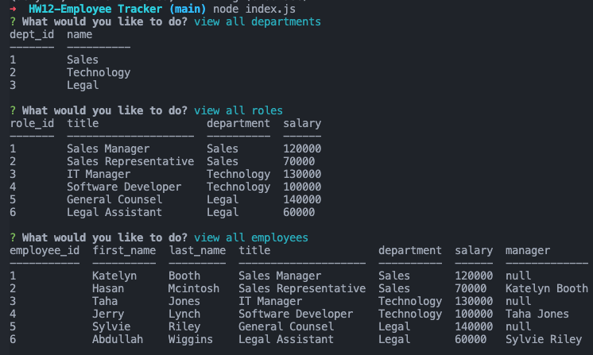
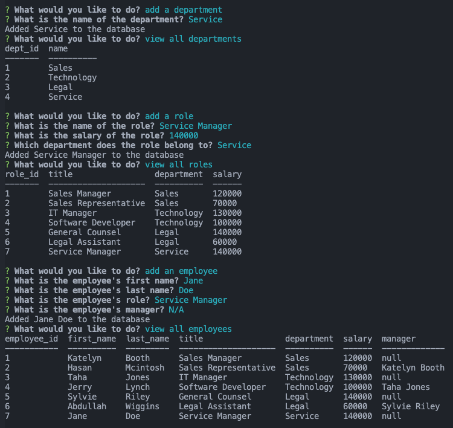
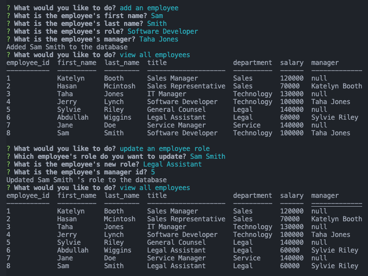

# SQL: Employee Tracker

## Table of Contents

- [Description](#description)
- [Technology](#Technology)
- [Installation](#installation)
- [Usage](#usage)
- [License](#license)
- [Contribution](#contribution)
- [Questions](#questions)

## Description

This back end project allows business owner to view and manage the departments, roles, and employees. It can be inserted data in sql files as well as the terminal console. By running the following command: `node index.js`, the application will take you to view, add or update information about the company.

## Technology

Project is created with:

- JavaScript
- Node.js
- Inquirer.js
- MySQL
- Node MySQL 2
- console.table

## Installation

To run this project, install it locally using npm:

```
npm install
```

## Usage

After installing npm packages, the application will be invoked by using the following command:

```
node index.js
```

#### Walkthrough Video

[Click me to see the demo video!](https://www.awesomescreenshot.com/video/7015399?key=3428a892b1ac4c806df108fb1bf83f03)

#### Example Screenshot





## License

[](https://opensource.org/licenses/MIT) <br>
This project is licensed under MIT, for more information please visit [this website](https://opensource.org/licenses/MIT)

## Contribution

Made by Wenwen Tian

## Questions?

Please feel free to contact me if you need any further information:

- [Email](mailto:wwtian9@gmail.com)
- [Github Profile](https://github.com/joce1ynn)
